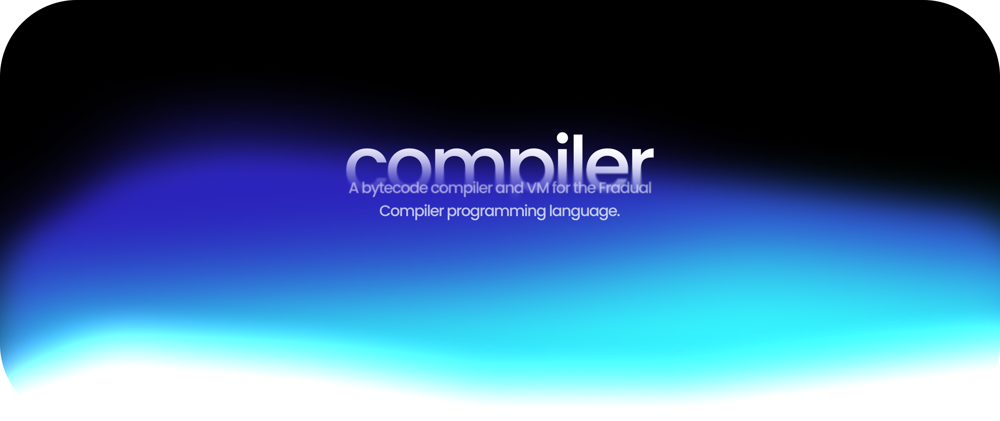
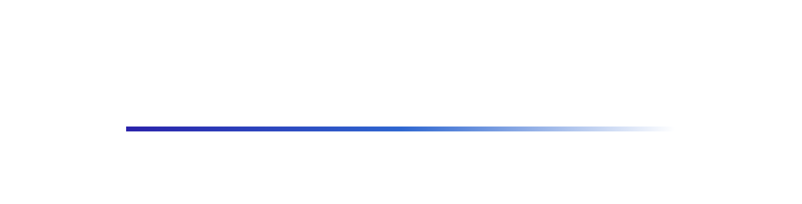

<div align="center">
<picture>
  
</picture>

<br />
<br />
<br />

  <a href="https://github.com/hypecavess">
    
  </a>
  <a href="https://nothingerr.com/">
    
  </a>
  <a href="LICENSE">
    
  </a>
  <a href="https://www.typescriptlang.org/">
    
  </a>

</div>

<br />
<br />

<div align="center">
  <h2>What is the Compiler?</h2>
</div>

The **Compiler** is a robust bytecode compiler and virtual machine designed for the **Fradual** programming language. Developed with performance and extensibility in mind, it transforms high-level source code into optimized bytecode, which is then executed by a stack-based virtual machine.

This project serves as both a production-ready implementation of the Fradual language and an educational resource for understanding compiler construction, bytecode generation, and VM architecture. Key features include:

-   **High-Performance VM**: A fast, stack-based virtual machine implementation.
-   **Strong Typing**: Built entirely in **TypeScript** for type safety and maintainability.
-   **Comprehensive Tooling**: Includes a lexer, parser, compiler, and disassembler.
-   **Extensible Design**: Modular architecture allowing for easy addition of new language features.

<br />
<br />

<div align="center">
  
  
  <br />
  <br />
</div>

Getting **Compiler** up and running is straightforward. Follow these steps to set up your environment and install the necessary dependencies.

**Method 1: Clone from Repository** (Recommended for development)

1.  **Clone the Repository**
    Start by cloning the official repository to your local machine using Git:
    ```bash
    git clone https://github.com/hypecavess/compiler.git
    ```

2.  **Navigate to Project Directory**
    Move into the newly created project folder:
    ```bash
    cd compiler
    ```

3.  **Install Dependencies**
    Install all required packages and dependencies using npm:
    ```bash
    npm install
    ```

4.  **Build the Project** (Optional but recommended)
    Compile the TypeScript source code to JavaScript:
    ```bash
    npm run build
    ```

**Method 2: Install via GitHub Packages**

To install the compiler from GitHub Packages, you need to configure your npm registry.

1.  **Configure Registry**
    Create a `.npmrc` file with the following content (or run the command):
    ```bash
    npm config set @hypecavess:registry https://npm.pkg.github.com
    ```

2.  **Install Globally**
    ```bash
    npm install -g @hypecavess/compiler
    ```

<br />
<br />

<div align="center">
  <h2>Quick Start & Examples</h2>
</div>

Check out the `examples/` directory for ready-to-run code samples.

To run an example:
```bash
# If cloned locally after building:
node dist/src/main.js examples/01_basics.fu

# If installed globally:
fradual examples/01_basics.fu
```

Explore more scripts in `examples/` to see loops, functions, and closures in action.

<br />
<br />
<div align="center">
  
  
  <br />
  <br />
</div>

For in-depth details about the specific components of the project, please refer to our full documentation located in the [`docs/`](docs/) directory:

-   **[[Language Reference]](docs/language_reference.md)**: Complete syntax guide, data types, and standard library.
-   **[[Architecture & Internals]](docs/architecture.md)**: Deep dive into the Compiler pipeline and VM instruction set.
-   **[[Development Guide]](docs/development.md)**: How to build, test, and contribute to the project.

<br />
<br />

<div align="center">
  
  
  <br />
  <br />
</div>

We warmly welcome contributions from the community to help shape the future of this project. As the **Compiler** is still in its early stages of development ("beta"), you may encounter incompleteness, bugs, or areas ripe for optimization. This is an exciting time to get involved!

We are actively looking for developers to help us stabilize the core, expand the standard library, and improve developer tooling. Whether you're fixing a critical bug, improving the documentation, or proposing entirely new language features, your input is invaluable. We are building something significant together, and every pull request brings us closer to a robust, production-ready tool.

Please read our **[Contributing Guidelines](CONTRIBUTING.md)** and **[Code of Conduct](CODE_OF_CONDUCT.md)** before getting started.

<br></br>
<br></br>

<p align="center">
  <a href="https://github.com/hypecavess/compiler/graphs/contributors">
    
  </a>
</p>

<br />
<br />

<div align="center">
  
  
  <br />
  <br />
</div>

This project is proudly developed by **[@hypecavess](https://github.com/hypecavess)**, officially verified and supported by **Nothinger**.

Our vision is ambitious: to evolve the Compiler into a major, foundational model capable of powering diverse applications across various domains. We are committed to continuous development and expansion, ensuring it becomes a staple tool for developers in the Nothinger ecosystem and beyond. The roadmap includes advanced optimization, a rich package ecosystem, and extensive tooling support.

*   **Email**: [hypecavess@gmail.com](mailto:hypecavess@gmail.com)
*   **Instagram**: [@hypecavess](https://instagram.com/hypecavess)
*   **Twitter (X)**: [@hypecavess](https://twitter.com/hypecavess)